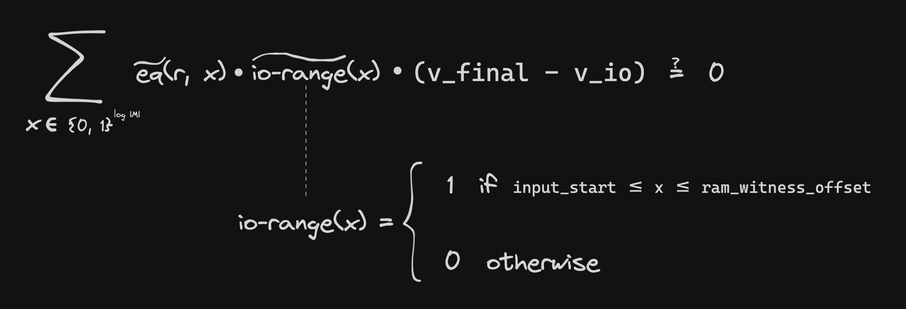

# Read-write memory (registers and RAM)

Jolt proves the validity of registers and RAM using offline memory checking.

## Memory layout

For the purpose of offline memory checking, Jolt treats registers, program inputs/outputs, and RAM as occupying one unified address space.
This remapped address space is laid out as follows:

The zero-padding depicted above is sized so that RAM starts at a power-of-two offset (this is explained [below](#handling-program-io)). 
As noted in the diagram, the size of the witness scales with the highest memory addressed over the course of the program's execution. 
In addition to the zero-padding between the "Program I/O" and "RAM" sections, the end of the witness is zero-padded to a power of two.

## Handling program I/O

### Inputs 

Program inputs and outputs (and the panic bit, which indicates whether the proram panicked) live in the same memory address space as RAM. 
Program inputs populate the designated input space upon initialization:

The verifier can efficiently compute the MLE of this initial memory state on its own (i.e. in time proportional to the IO size, not the total memory size).

### Ouputs and panic

On the other hand, the verifier cannot compute the MLE of the final memory state on its own –– though the program I/O is known to the verifier, the final memory state contains values written to registers/RAM over the course of program execution, which are *not* known to the verifier.

The verifier is, however, able to compute the MLE of the program I/O values (padded on both sides with zeros) –– this is denoted `v_io` below. 
If the prover is honest, then the final memory state (`v_final` below) should agree with `v_io` at the indices corresponding to program I/O. 

To enforce this, we invoke the sumcheck protocol to perform a "zero-check" on the difference between `v_final` and `v_io`:

This also motivates the zero-padding between the "Program I/O" and "RAM" sections of the witness. The zero-padding ensures that both `input_start` and `ram_witness_offset` are powers of two, which makes it easier for the verifier to compute the MLEs of `v_init` and `v_io`. 

## Timestamp range check

In contrast to our usage of offline memory checking in other modules, registers and RAM are *writable* memory. 
This distinction introduces additional requirements.

The multiset equality check, typically expressed as $I \cdot W = R \cdot F$, is not adequate for ensuring the accuracy of read values. 
It is essential to also verify that each read operation retrieves a value that was written in a *previous* step (not a future step).

To formalize this, we assert that the timestamp of each read operation, denoted as $\text{read\_timestamp}$, must not exceed the global timestamp at that particular step. 
The global timestamp starts at 0 and is incremented once per step.

The verification of $\text{read\_timestamp} \leq \text{global\_timestamp}$ is equivalent to confirming that $\text{read\_timestamp}$ falls within the range $[0, \text{TRACE\_LENGTH})$ and that the difference $(\text{global\_timestamp} - \text{read\_timestamp})$ is also within the same range.

The process of ensuring that both $\text{read\_timestamp}$ and $(\text{global\_timestamp} - \text{read\_timestamp})$ lie within the specified range is known as range-checking. This is the procedure implemented in [`timestamp_range_check.rs`](../../../jolt-core/src/jolt/vm/timestamp_range_check.rs), using a modified version of Lasso.
